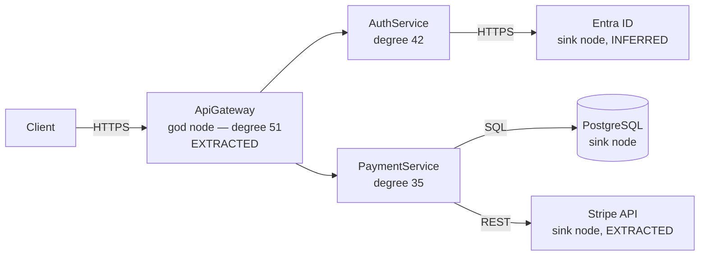
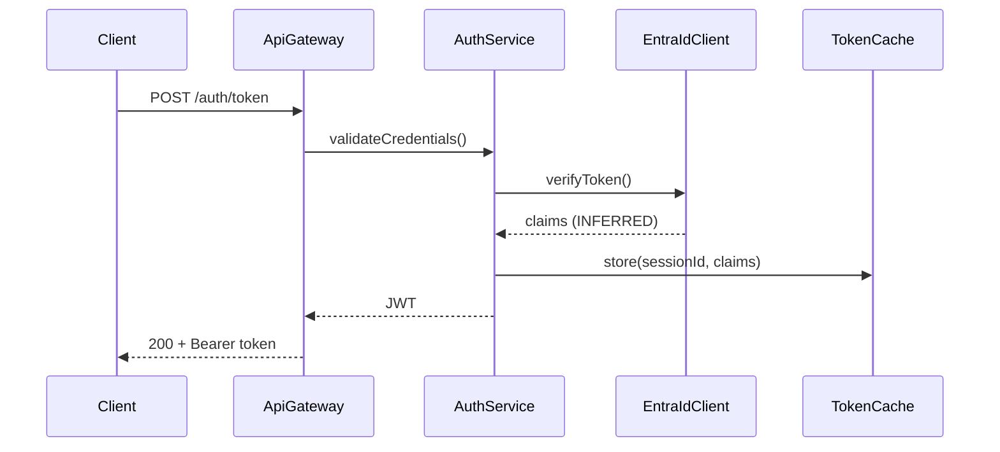
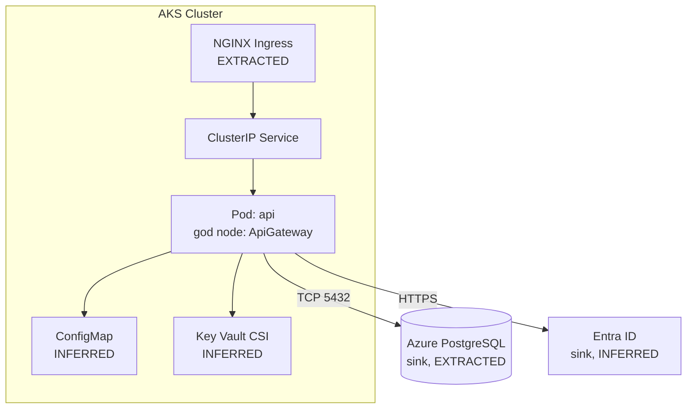

# Prompt: Generate ARCHITECTURE.md (powered by Graphify)

<!-- ============================================================
     PLATFORM VARIANTS — pick the one that matches your tool
     ============================================================ -->

## GitHub Copilot — VS Code Chat (`@workspace`)

> **Prerequisites — run once in your repo:**
> ```bash
> uv tool install graphifyy
> graphify install              # registers /graphify skill in Claude Code
> graphify vscode install       # registers graphify in VS Code Copilot Chat
> graphify copilot install      # registers graphify in GitHub Copilot CLI
> ```
>
> **Step 1 — Build the knowledge graph** (commit the output so the whole team benefits):
> ```bash
> /graphify .
> # Produces: graphify-out/graph.json  graphify-out/GRAPH_REPORT.md  graphify-out/graph.html
> ```
>
> **Step 2 — Export call-flow diagrams:**
> ```bash
> graphify export callflow-html
> # Produces: graphify-out/<project>-callflow.html
> ```
>
> **Step 3a — VS Code Copilot Chat:**
> Open VS Code → Copilot Chat panel → paste this entire prompt and send.
> Copilot Chat will use `@workspace` to access `graphify-out/` automatically.
>
> **Step 3b — GitHub Copilot CLI:**
> ```bash
> ghcs "$(cat .github/copilot/generate-architecture.md)"
> # ghcs = gh copilot suggest; output redirected manually:
> # ghcs "$(cat .github/copilot/generate-architecture.md)" > ARCHITECTURE.md
> ```
>
> **Step 3c — Claude Code (alternative runner):**
> ```bash
> claude --bare -p "$(cat .github/copilot/generate-architecture.md)" \
>   --allowedTools "Read,Glob,Bash" \
>   --output-format json | jq -r '.result' > ARCHITECTURE.md
> ```
>
> **Headless CI (ADO pipeline / GitHub Actions):**
> ```yaml
> # azure-pipelines.yml or .github/workflows/architecture.yml
> - script: |
>     pip install graphifyy
>     graphify extract . --backend claude   # or --backend openai
>     graphify export callflow-html
>     # Claude Code runner (no IDE needed in CI):
>     claude --bare -p "$(cat .github/copilot/generate-architecture.md)" \
>       --allowedTools "Read,Glob,Bash" \
>       --output-format json | jq -r '.result' > ARCHITECTURE.md
>   displayName: Generate ARCHITECTURE.md
>   env:
>     ANTHROPIC_API_KEY: $(ANTHROPIC_API_KEY)
> ```

---

<!-- ============================================================
     COPILOT CONTEXT BLOCK
     GitHub Copilot Chat reads this as @workspace context.
     VS Code Copilot Chat: these #file references load automatically.
     Copilot CLI: paste prompt verbatim — Copilot resolves workspace context.
     ============================================================ -->

## Copilot Context Files

> **For VS Code Copilot Chat** — these file references are resolved automatically
> via `@workspace`. If any file is missing, Copilot will note it and skip that section.

```
#file:graphify-out/GRAPH_REPORT.md
#file:graphify-out/graph.json
#file:README.md
#file:package.json
#file:pyproject.toml
#file:go.mod
#file:Cargo.toml
#file:Dockerfile
#file:docker-compose.yml
#file:.env.example
#file:openapi.yaml
#file:swagger.yaml
```

> **Note for Copilot CLI / headless use:** Copilot CLI does not support `#file:` references.
> Ensure `graphify-out/` is committed and present in the working directory before running.
> The prompt instructs Copilot to read those files explicitly in Phase 1.

---

## Your Task

You are a senior software architect. Generate a comprehensive, accurate `ARCHITECTURE.md`
for this repository. Use the Graphify knowledge graph as your primary source of truth.
The graph has already mapped the entire codebase — do not re-read source files unless
filling a gap the graph doesn't cover.

**Important for GitHub Copilot:**
- Use `@workspace` to access all files listed in the Context Files block above.
- Prefer `graphify-out/GRAPH_REPORT.md` and `graphify-out/graph.json` over manual file scanning.
- When the graph has a confidence tag (`EXTRACTED`, `INFERRED`, `AMBIGUOUS`), carry it through into the document.
- Do not fabricate information. If something is unclear, write `> ⚠️ TODO: verify`.
- The final output must be a complete, standalone Markdown file — no placeholders.

---

## Phase 1 — Load the Graphify Knowledge Graph

Work through all steps before writing a single line of the document.

### 1.1 — Read GRAPH_REPORT.md (mandatory first step)

Read `graphify-out/GRAPH_REPORT.md` via `@workspace` (VS Code) or directly from disk (CLI/CI).

Internalize:
- **God nodes** — highest-centrality concepts; the architectural load-bearers.
- **Surprising connections** — cross-module links ranked by unexpectedness; reveal hidden coupling.
- **Design rationale** — extracted `# NOTE:`, `# WHY:`, `# HACK:` comments and docstrings.
- **Suggested questions** — the graph's own recommended queries; answer them in the doc.
- **Confidence tags** — `EXTRACTED` / `INFERRED` / `AMBIGUOUS`; propagate into every section.

### 1.2 — Query graph.json

Read `graphify-out/graph.json` via `@workspace`. Extract:

- **Top 20 nodes by degree** → architectural load-bearers (god nodes)
- **All cluster labels and sizes** → bounded contexts / service boundaries
- **Entry point nodes** (no inbound edges) → public surface, CLI entry, API handlers
- **Sink nodes** (no outbound edges) → databases, queues, external APIs

If running in a terminal (CLI or CI), use these shell one-liners:

```bash
# God nodes by degree
python3 -c "
import json, sys
g = json.load(open('graphify-out/graph.json'))
nodes = sorted(g['nodes'], key=lambda n: n.get('degree', 0), reverse=True)[:20]
for n in nodes: print(n.get('degree',0), n.get('id',''), n.get('type',''), n.get('cluster',''))
"

# Cluster sizes
python3 -c "
import json
from collections import Counter
g = json.load(open('graphify-out/graph.json'))
clusters = Counter(n.get('cluster','unknown') for n in g['nodes'])
for c, count in clusters.most_common(): print(count, c)
"

# Entry points (no inbound edges)
python3 -c "
import json
g = json.load(open('graphify-out/graph.json'))
targets = {e['target'] for e in g.get('edges',[])}
print([n['id'] for n in g['nodes'] if n['id'] not in targets][:20])
"

# Sinks (no outbound edges)
python3 -c "
import json
g = json.load(open('graphify-out/graph.json'))
sources = {e['source'] for e in g.get('edges',[])}
print([n['id'] for n in g['nodes'] if n['id'] not in sources][:20])
"
```

### 1.3 — Run Graphify Queries

**In VS Code Copilot Chat:** type each query below as a follow-up message using `/graphify`:
```
/graphify query "what are the main entry points and top-level flows?"
/graphify query "what connects authentication to the rest of the system?"
/graphify query "show the data model and storage layer"
/graphify query "what external services or APIs does this system call?"
/graphify query "what infrastructure and deployment artifacts exist?"
/graphify query "what connects logging or observability to the system?"
/graphify query "what connects configuration or secrets to the system?"
```

**In terminal (CLI/CI):**
```bash
graphify query "what are the main entry points and top-level flows?"
graphify query "what connects authentication to the rest of the system?"
graphify query "show the data model and storage layer"
graphify query "what external services or APIs does this system call?"
graphify query "what infrastructure and deployment artifacts exist?"
graphify query "what connects logging or observability to the system?"
graphify query "what connects configuration or secrets to the system?"
# Replace with actual god node names from GRAPH_REPORT.md:
graphify path "<god_node_1>" "<god_node_2>"
```

### 1.4 — Extract Call-Flow Mermaid Diagrams

Read `graphify-out/<project>-callflow.html` via `@workspace` (VS Code) or from disk.
Extract all `mermaid` code blocks. Use them verbatim in the Data Flow section —
do not invent diagrams that contradict the graph.

If the file does not exist yet:
```bash
graphify export callflow-html
```

### 1.5 — Supplementary Reads (gap-fill only)

Read these **only for information absent from the graph**:

```
README.md                               — project purpose, badges, setup
Dockerfile / docker-compose.yml         — base images, port mappings
.github/workflows/ or azure-pipelines.yml — CI stage names and triggers
*.env.example / config/                 — exact env variable names and defaults
openapi.yaml / swagger.yaml             — exact API paths and parameters
SQL migration files                     — exact column names and types
```

Do **not** re-scan the entire source tree — the graph already captured it.

---

## Phase 2 — Write ARCHITECTURE.md

Produce the full document below. Rules:

- **Confidence tags in every factual claim:** `(EXTRACTED)`, `(INFERRED)`, `(AMBIGUOUS)`
- **AMBIGUOUS callouts:** `> ⚠️ AMBIGUOUS: <description> — needs human review`
- **Missing data:** `> ℹ️ Not applicable for this repository.`
- **Unverifiable claims:** `> ⚠️ TODO: verify`
- **No placeholders** — every section is either populated or explicitly marked N/A
- **Mermaid diagrams** from callflow export; supplement with context diagrams where helpful
- **Target length:** 500–2000 lines depending on complexity

---

```markdown
# Architecture

> **Last updated:** <!-- today's date -->
> **Maintainer:** <!-- from CODEOWNERS or README -->
> **Graph version:** <!-- from GRAPH_REPORT.md header if present -->
> **Generated with:** [Graphify](https://github.com/safishamsi/graphify)

## Table of Contents

1. [Overview](#overview)
2. [Knowledge Graph Summary](#knowledge-graph-summary)
3. [Repository Structure](#repository-structure)
4. [System Context](#system-context)
5. [Component Breakdown](#component-breakdown)
6. [Data Flow](#data-flow)
7. [API Surface](#api-surface)
8. [Data Model](#data-model)
9. [Infrastructure & Deployment](#infrastructure--deployment)
10. [CI/CD Pipeline](#cicd-pipeline)
11. [Configuration & Secrets](#configuration--secrets)
12. [Security Considerations](#security-considerations)
13. [Observability](#observability)
14. [Dependencies](#dependencies)
15. [Key Design Decisions](#key-design-decisions)
16. [Known Limitations & TODOs](#known-limitations--todos)

---

## Overview

<!--
3–5 sentences:
- Business purpose — from README + graph summary
- System type (REST API / event-driven worker / CLI / monorepo / library)
- Primary consumers / clients
- Tech stack — from god node types and cluster labels in graph.json

Source: GRAPH_REPORT.md summary + README.md (@workspace)
-->

---

## Knowledge Graph Summary

<!--
Metadata that explains the accuracy basis of this document.

### God Nodes — Top 10 by Centrality
The architectural load-bearers; everything flows through these.
Source: GRAPH_REPORT.md

| Rank | Node | Type | Cluster | Degree | Confidence |
|------|------|------|---------|--------|------------|
| 1 | `AuthService` | Class | auth | 42 | EXTRACTED |
| 2 | `DatabasePool` | Module | data | 38 | EXTRACTED |

### Bounded Contexts — Graph Clusters
Source: graph.json cluster detection

| Cluster | Nodes | Summary |
|---------|-------|---------|
| `auth` | 14 | JWT validation, session management, Entra ID integration |
| `data` | 22 | ORM models, migration runner, connection pooling |

### Surprising Connections (Top 5)
Source: GRAPH_REPORT.md — cross-cluster links ranked by unexpectedness

1. `PaymentService` ↔ `AuthService` via `UserContext` — unexpected direct coupling
2. ...

### Extracted Design Rationale
Source: GRAPH_REPORT.md — `# NOTE:` / `# WHY:` / `# HACK:` comments

- `WHY: optimistic locking to avoid deadlocks under high concurrency`
  → `src/payments/payment.service.ts:112` (EXTRACTED)
- `HACK: bypassing cache TTL for admin users — see ADR-003`
  → `src/auth/session.service.ts:67` (EXTRACTED)
-->

---

## Repository Structure

<!--
Top 2–3 level annotated tree. Tag each directory with cluster label and god nodes.

```
.
├── src/
│   ├── api/          # [Cluster: api] Route handlers — god node: ApiGateway (degree 51)
│   ├── services/     # [Cluster: business] Core business logic
│   ├── models/       # [Cluster: data] ORM models — god node: DatabasePool (degree 38)
│   └── utils/        # [Cluster: shared] Leaf utilities, no cross-cluster inbound edges
├── infra/
│   ├── helm/         # Kubernetes Helm chart
│   └── terraform/    # Cloud resource provisioning
├── graphify-out/     # Knowledge graph (committed to git)
│   ├── graph.json
│   ├── GRAPH_REPORT.md
│   └── graph.html    # Interactive browser explorer — open to explore the graph visually
└── tests/
```

Source: graph.json cluster assignments + directory listing (@workspace)
-->

---

## System Context

<!--
System's position in the broader landscape.

Entry point nodes (no inbound edges) → public surface
Sink nodes (no outbound edges) → external dependencies
graphify query: "what external services or APIs does this system call?"



Source: graph.json entry/sink nodes
        graphify query "what external services or APIs does this system call?"
-->

---

## Component Breakdown

<!--
One subsection per graph cluster. Use cluster label as component name.

### <Cluster Name>
| Property | Detail |
|----------|--------|
| **Cluster** | `auth` (14 nodes) |
| **God node** | `AuthService` (degree 42, EXTRACTED) |
| **Responsibility** | JWT validation, session management, Entra ID OAuth2 |
| **Key files** | `src/auth/auth.service.ts`, `src/auth/jwt.middleware.ts` |
| **Called by** | `ApiGateway`, `UserService` (EXTRACTED) |
| **Calls** | `EntraIdClient` (sink, INFERRED), `TokenCache` (EXTRACTED) |
| **Surprising links** | Directly coupled to `PaymentService` via `UserContext` — see Known Limitations |
| **Confidence** | EXTRACTED |

Repeat for each cluster in graph.json.

Source: graph.json cluster metadata
        graphify query per cluster (@workspace or terminal)
-->

---

## Data Flow

<!--
Paste Mermaid blocks verbatim from graphify-out/<project>-callflow.html.
Do NOT invent flows that contradict the graph.

### Flow: <Name from callflow export>
> Source: graphify-out/<project>-callflow.html (EXTRACTED)



Walk-through (god nodes as waypoints):
1. `ApiGateway` (god node, degree 51) — entry point node (EXTRACTED)
2. Delegates to `AuthService` (god node, degree 42) (EXTRACTED)
3. `AuthService` → `EntraIdClient` (sink) — outbound to Entra ID (INFERRED)
4. Session written to `TokenCache` — surprising connection in GRAPH_REPORT.md
5. Returns signed JWT

Source: graphify-out/<project>-callflow.html
        graphify path "<god_node_1>" "<god_node_2>"
-->

---

## API Surface

<!--
From graph.json entry-point nodes (no inbound edges) + openapi.yaml supplement.

### REST Endpoints
| Method | Path | Auth | Handler node | Degree | Confidence |
|--------|------|------|-------------|--------|------------|
| GET | `/health` | None | `HealthController` | 3 | EXTRACTED |
| POST | `/auth/token` | None | `AuthController` | 18 | EXTRACTED |
| POST | `/payments` | Bearer JWT | `PaymentController` | 22 | EXTRACTED |

### Event Streams (if applicable)
| Topic | Direction | Producer | Consumer | Confidence |
|-------|-----------|----------|---------|------------|
| `payment.completed` | Publish | `PaymentService` | `NotificationWorker` | EXTRACTED |
| `order.created` | Subscribe | `OrderService` | `PaymentService` | INFERRED |

Source: graph.json entry-point nodes (no inbound edges)
        graphify query "what are the main entry points and top-level flows?"
        openapi.yaml (supplementary, @workspace)
-->

---

## Data Model

<!--
From graphify query "show the data model and storage layer".

### Entity: `Payment` (EXTRACTED, cluster: data)
| Column | Type | Confidence |
|--------|------|------------|
| `id` | UUID PK | EXTRACTED |
| `order_id` | UUID FK → Order | EXTRACTED |
| `amount` | DECIMAL(10,2) | EXTRACTED |
| `status` | ENUM | INFERRED |
| `created_at` | TIMESTAMP | INFERRED |

Note any surprising entity connections from GRAPH_REPORT.md.
Note migration strategy (Flyway / Alembic / Prisma / Liquibase) if present in graph.

Source: graphify query "show the data model and storage layer"
        graph.json nodes with type=model or type=table
        Migration files (supplementary, @workspace)
-->

---

## Infrastructure & Deployment

<!--
From graphify query "what infrastructure and deployment artifacts exist?"



Note environment differences (dev/staging/prod) if infra nodes have env labels.

Source: graphify query "what infrastructure and deployment artifacts exist?"
        graph.json infra cluster nodes
        Helm / Terraform / Dockerfile (@workspace, supplementary)
-->

---

## CI/CD Pipeline

<!--
From graph CI/CD nodes + pipeline YAML supplement.

### Pipeline Stages
| Stage | Trigger | Key steps | Gate | Confidence |
|-------|---------|-----------|------|------------|
| PR Validation | PR open/update | Lint, test, SAST | All pass | EXTRACTED |
| Build | Merge to main | Docker build, sign, push | Image scan | EXTRACTED |
| Deploy Staging | Merge to main | Helm upgrade | Smoke tests | INFERRED |
| Deploy Prod | Manual approval | Helm upgrade | Canary check | INFERRED |

Note branch strategy and rollback mechanism.

Source: .github/workflows/ or azure-pipelines.yml (@workspace, supplementary)
        graph.json pipeline nodes
-->

---

## Configuration & Secrets

<!--
From graphify query "what connects configuration or secrets to the system?"

| Variable | Source | Required | Confidence | Description |
|----------|--------|----------|------------|-------------|
| `DATABASE_URL` | Key Vault CSI | Yes | EXTRACTED | PostgreSQL connection string |
| `STRIPE_API_KEY` | Key Vault CSI | Yes | EXTRACTED | Stripe secret key |
| `PORT` | ConfigMap | No | INFERRED | HTTP port, default 8080 |
| `LOG_LEVEL` | ConfigMap | No | INFERRED | debug/info/warn/error |

Source: graphify query "what connects configuration or secrets to the system?"
        graph.json config/secret nodes
        *.env.example (@workspace, supplementary)
-->

---

## Security Considerations

<!--
From graphify query "what connects authentication to the rest of the system?"

- Auth mechanism — from auth cluster god node + outbound sinks to IdP
- Authorization model — policy nodes (OPA / Cedar / RBAC middleware)
- Network security — infra cluster (Zscaler, WAF, NetworkPolicy)
- Supply chain — CI nodes (Cosign, SBOM, Semgrep, Gitleaks)
- Audit logging — observability cluster

Prominently flag AMBIGUOUS relationships in the auth cluster:

> ⚠️ AMBIGUOUS: `CacheService` connected to both `AuthService` and `PaymentService`
> — shared mutable cache across security boundaries — verify intent.

Source: graphify query "what connects authentication to the rest of the system?"
        GRAPH_REPORT.md surprising connections in auth cluster
-->

---

## Observability

<!--
From graphify query "what connects logging or observability to the system?"

| Concern | Node / Tool | Cluster | Confidence |
|---------|------------|---------|------------|
| Metrics | `MetricsCollector` → Prometheus | observability | EXTRACTED |
| Logging | `Logger` → Fluent Bit → ELK | observability | EXTRACTED |
| Tracing | `TraceContext` → OpenTelemetry | observability | INFERRED |
| Alerting | PagerDuty (sink node) | observability | INFERRED |
| LLM traces | Langfuse (sink node) | observability | EXTRACTED |

Source: graphify query "what connects logging or observability to the system?"
        graph.json observability cluster nodes
-->

---

## Dependencies

<!--
From graph nodes of type=external-lib ranked by degree (most-coupled first).

### Runtime
| Dependency | Version | Degree | Confidence | Purpose |
|------------|---------|--------|------------|---------|
| Express | 4.18.x | 28 | EXTRACTED | HTTP framework |
| pg | 8.x | 19 | EXTRACTED | PostgreSQL client |

### Infrastructure
| Dependency | Version | Confidence | Purpose |
|------------|---------|------------|---------|
| Kubernetes | 1.28+ | EXTRACTED | Container orchestration |
| Helm | 3.x | EXTRACTED | Package management |

Source: graph.json external-lib nodes by degree
        package.json / go.mod / pyproject.toml (@workspace, supplementary for versions)
-->

---

## Key Design Decisions

<!--
From GRAPH_REPORT.md "Design Rationale" section.
Each # WHY: / # NOTE: comment extracted by graphify becomes an ADR summary.

### ADR-001: <Title from WHY comment>
- **Status:** Accepted
- **Source:** `src/auth/session.service.ts:67` (EXTRACTED)
- **Context:** <Paraphrase of the WHY comment>
- **Decision:** <What was implemented>
- **Consequences:** <Trade-offs; flag HACK annotations>

Also note surprising connections from GRAPH_REPORT.md that imply
undocumented decisions worth formalising as ADRs.

Source: GRAPH_REPORT.md "Design Rationale" + "Surprising Connections"
-->

---

## Known Limitations & TODOs

<!--
From graph signals only — do not invent:

1. AMBIGUOUS-tagged relationships → flag for human verification
2. HACK nodes → tech debt
3. Orphan nodes (no inbound edges, not entry points) → possible dead code
4. High-unexpectedness surprising connections → coupling to address

- [ ] `HACK: bypassing cache TTL for admin users` — `src/auth/session.service.ts:67` (EXTRACTED)
- [ ] Orphaned module: `src/legacy/v1-adapter.ts` — no inbound edges, possible dead code (INFERRED)
- [ ] Surprising coupling: `PaymentService` → `AuthService` direct call — should route via gateway (AMBIGUOUS)
- > ⚠️ AMBIGUOUS: `CacheService` shared between auth and payment clusters — shared mutable state risk
- > ⚠️ TODO: verify Kafka consumer group IDs — not found in graph or config files

Source: GRAPH_REPORT.md AMBIGUOUS/HACK nodes
        graph.json orphan analysis (no inbound edges, not entry points)
-->
```

---

## Output Requirements

- Output a complete, self-contained Markdown file — no meta-commentary, no preamble.
- Use **Mermaid diagrams from `graphify export callflow-html`** verbatim; supplement only where the callflow export has gaps.
- Every factual claim cites its graph source: `(EXTRACTED, degree 42)` or `(INFERRED, cluster: auth)`.
- Propagate confidence tags throughout: `EXTRACTED`, `INFERRED`, `AMBIGUOUS`.
- Highlight `> ⚠️ AMBIGUOUS:` prominently — these need human review before the doc is final.
- If a section has no graph data: `> ℹ️ Not applicable for this repository.`
- Target length: 500–2000 lines depending on repo complexity.
- A new engineer should fully understand the system from this document alone without running graphify.

---

<!-- ============================================================
     FILE PLACEMENT GUIDE
     ============================================================
     Claude Code / ADO pipeline:
       .claude/prompts/generate-architecture.md

     GitHub Copilot CLI / VS Code Copilot Chat:
       .github/copilot/generate-architecture.md

     Both tools can coexist — copy to both paths if needed.
     ============================================================ -->
